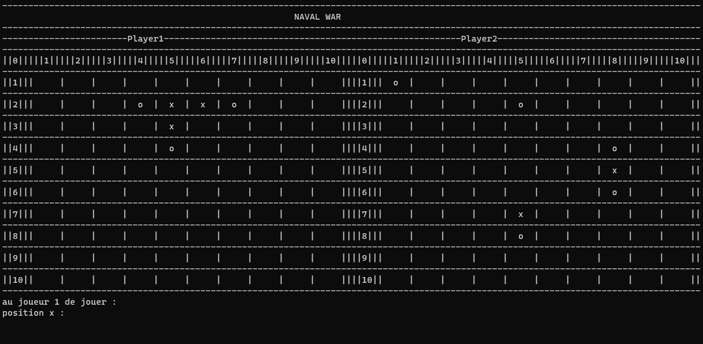

# Note

La Bataille Navale est un jeu de stratégie pour deux joueurs. Chaque joueur possède une grille de jeu sur laquelle sont positionnés plusieurs navires de tailles différentes. Le but est de deviner l'emplacement des navires de l'adversaire en lançant des "tirs" sur des cases de la grille, en utilisant des coordonnées (comme "A-3" ou "B-7") pour spécifier l'emplacement du tir.

Mathématiquement, on peut représenter la grille de jeu comme une matrice, où chaque case est identifiée par des coordonnées. Les navires sont positionnés en occupant plusieurs cases adjacentes dans la grille, et les joueurs tentent de deviner la position de ces navires en faisant des tirs sur différentes coordonnées.

On peut utiliser des techniques mathématiques pour optimiser la stratégie de tir, comme les algorithmes de recherche pour déterminer la position des navires adverses en minimisant le nombre de tirs nécessaires. Par exemple, des méthodes telles que la recherche dichotomique peuvent être utilisées pour réduire l'espace de recherche des navires sur la grille.

Le jeu se poursuit jusqu'à ce que tous les navires d'un joueur soient coulés. Le gagnant est celui qui parvient à couler tous les navires de son adversaire en effectuant un nombre minimal de tirs.

# Demo
